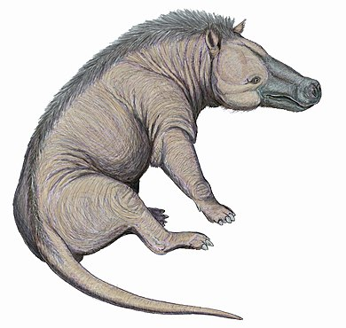

# 鸫丘中
一座在山顶（鸫丘）上的学校。放山上没有别的意思，纯粹是希望它有口井。

## 集中式教育
国土过于辽阔而地方上的教育资源稀缺，导致人们决定把义务教育的后半段通过选拔召集到各级行政区的中心，造成的结果是一种集中式的义务教育。选拔定期举行，类似科举。鸫丘中作为教育部直属机构，是集中式教育在义务教育阶段的顶点。\
在集中式教育的全盛时期，鸫丘中的学生总数可能达到数万。后期这种教育模式的弊病日渐显著，在联盟破裂之前就已经名存实亡。

## 学群
应对上述集中式教育，在鸫丘中内部分出来的类似霍格沃茨的学院那样的东西。理论上，学群的存在只是为了把几万人口调配开来分拨上课，但是实际操作中形成了习惯和种姓制度（？）
- 第一学群：学校的拳头学群。接纳各地小镇做题家，这里的人们能文能武，又红又专。学霸度在全校甚至全国是一骑绝尘，以至于需要在校内拥有自己的排名计算公式和独立分数线。但也正是在这里，集中教育的种种弊病得到放大。
- 第五学群：收集了首都公务员的子弟，人均婆罗门。可能在内部存在某种变相察举制来综合考察考试成绩/社会活跃度/家庭出身

从名字推测应该至少还有第二三四学群，暂定里面都是一帮normie

## 精英病
一种疯病，会在鸫丘中学内部随机折损学生。特征是发作时丧尸化，会袭击路人，还会励起周身的潜在患者一起发作。及时控制可以去丧尸化并恢复理智，但是会对大脑造成不可逆的损伤，从此无法参与校内热火朝天的内卷。而在鸫丘中，这基本意味着被彻底淘汰。精英病的后遗症即是这种器质性精神障碍。\
精英病是个俗名，正式学名叫（未定）。精英病的存在本身被学校严格保密，对精英病的研究只限定在校内。可能的机理是发作时神经系紊乱。后期（什么时候？）人们发现其下有至少两种亚型，丧尸化严重的一种称为E型，后遗症严重的称为I型。

# 接触回路技术
大概是一种对模拟信号的功率放大回路。技术本身大概是什么军事研究，但是研究出个眉目之后都快终战了，并没有得到什么应用，反而是在战后得到蓬勃发展。在生活中的方方面面都得到应用，小到回路小家电，大到回路盾构机。但最初的目的可能是一种远程通信

## 接触射击
使用接触回路把物体射击出去的技术，特长是使用接触技术可以绕过有关枪支的法律：接触枪的分类是“医疗器械”。但只要把回路造得足够强力它理论上可以用来弹射任何东西。\
仅靠接触回路就能获得作为医疗器械的接触枪所需要的子弹初速，所以可以压缩膛室和枪管到极限，腾出来的空间用来安置相对而言非常巨大的回路本体。事实上，由于为了把初速控制在范围内的上下限制约（限制器）非常繁琐，接触回路小型化的技术到了非常晚才出现或压根没出现，所以一把枪大部分都是回路，形似一块砖。

### 乙型阻断剂弹
由于精英病的特殊性质，麻药无法对发作者生效；另一方面发作时攻击性增加，即使是三五大汉也可能无法近身。所以采用接触射击来控制在校园生活中的各种场面突然兴奋的患者。药剂被称作乙型阻断剂，其作用十分粗暴，快速作用于神经而相当于等效地砍断手脚。\
药剂出现的时间大概是战后二十年，略早于产生初代魔法少女的时间。\
[ ] 阻断解除药？

### 三发规则
使用射手控制发作者的思路起源于尽量不干扰学校生活的愿望。如果控制成功，那么就不需要停课/封锁现场，只需要叫校医院回收失去行动力的患者。\
但是持枪者毕竟是训练不充分的学生，这是个非常类似校园枪击的场景。学生们虽然不希望天天停课，但也不希望万一自己发病时被暴力执法射爆，所以经由学生会提出/通过了三发规则。如果三发都没能控制目标，射手必须停止射击，然后停课/让所有人撤离现场，等校医院收拾残局。\
三法规则没有任何科学依据，纯粹体现了人的愿望。反过来射手为了完成KPI只好搞些风骚的操作。

# 电气鲸/山鲸
学校中游荡的谜之猛兽，昼伏夜出，以吃灵魂为生。虽然捕猎技能点满但牙口不行，如果没有灵魂就只能食腐。和共享栖息地的兔子/人类相比智力十分低下，但有微不足道的社会性。\
出没时能影响空间性质，形成所谓的迷宫。~~日后受过高等教育的魔法少女会注意到这种影响的本质是利用有限元法将空间离散化并进行插值~~\
能发出**鲸歌**来探测空间，寻找猎物和进行上文所说的微不足道的社会交流。鲸歌无法被鲸以外的东西捕获，但一部分兔子进化出了接收鲸歌的听觉。

参考了下图[这个玩意儿](https://zh.wikipedia.org/wiki/%E5%AE%89%E6%B0%8F%E4%B8%AD%E7%8D%B8)。\
[这个图说](img/Giantpredatorsscale1.png)它大概有北极熊那么大，但“鲸”显然是更正确的认识。\
\

# 兔
一个长期活动在鸫丘上的文明，其中心是位于鸫丘中的封建帝国，在某个时期为了躲避天敌鲸而逃进了地下。内部存在一种种姓制度，在这个制度中等级高的居民更靠近位于地下的中心。文明最外围是被放逐而成为蛮夷的游牧民，也是对鲸斗争的最前线。\
整个文明都试图避免和外部接触，也忌讳人类。

## 魔法少女/石榴挂坠
（待考）
